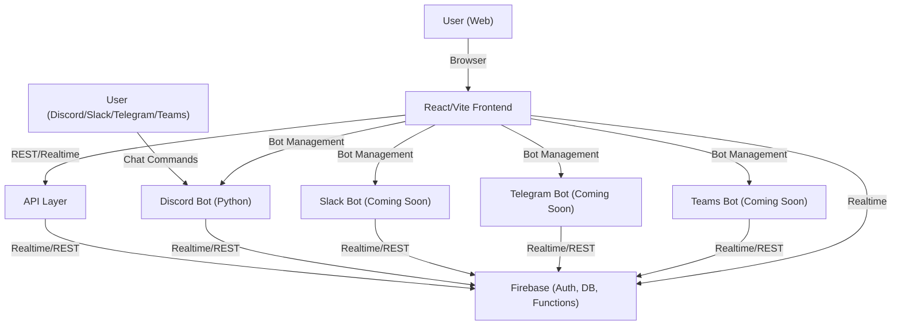

# Crewmate

[](https://react.dev/)
[](https://vitejs.dev/)
[](https://python.org/)
[](https://firebase.google.com/)

---

## 🚀 Hackathon Quickstart
- **Demo:** [https://crewmate-demo.vercel.app](https://crewmate-demo.vercel.app)
- **Live Deployment:** [https://crewmate-app.vercel.app](https://crewmate-app.vercel.app)
- `pnpm install && pnpm dev` in `apps/crewmate-dashboard` to run locally
- No login required—just click **Sign In** to view the dashboard!

> **Disclaimer:** Crewmate is a fan-made project and is not affiliated with Among Us or Innersloth LLC. All trademarks are property of their respective owners.

## Features
- Native integration with Discord, Slack, Telegram, and Teams
- AI-powered natural language commands
- Real-time analytics and reporting
- Secure, privacy-first design
- Lightning fast onboarding
- Modern web dashboard for managing tasks, performance, and teams

---

## 🗺️ Architecture Diagram



---

## Getting Started

### Prerequisites
- Node.js (v16+ recommended)
- pnpm or npm

### Running the Dashboard

1. Navigate to the dashboard app directory:
   ```sh
   cd crewmate/apps/crewmate-dashboard
   ```
2. Install dependencies:
   ```sh
   pnpm install
   # or
   npm install
   ```
3. Start the development server:
   ```sh
   pnpm dev
   # or
   npm run dev
   ```
4. Open [http://localhost:5174](http://localhost:5174) in your browser.

### Running the Discord Bot

1. Navigate to the Discord app directory:
   ```sh
   cd crewmate/apps/discord
   ```
2. Install Python dependencies:
   ```sh
   pip install -r requirements.txt
   ```
3. Configure your bot token and Firebase credentials as needed.
4. Run the bot:
   ```sh
   python main.py
   ```

## Contributing

Pull requests are welcome! For major changes, please open an issue first to discuss what you would like to change.

1. Fork the repository
2. Create your feature branch (`git checkout -b feature/your-feature`)
3. Commit your changes (`git commit -am 'Add new feature'`)
4. Push to the branch (`git push origin feature/your-feature`)
5. Open a pull request

## License

This project is for educational and demonstration purposes. 